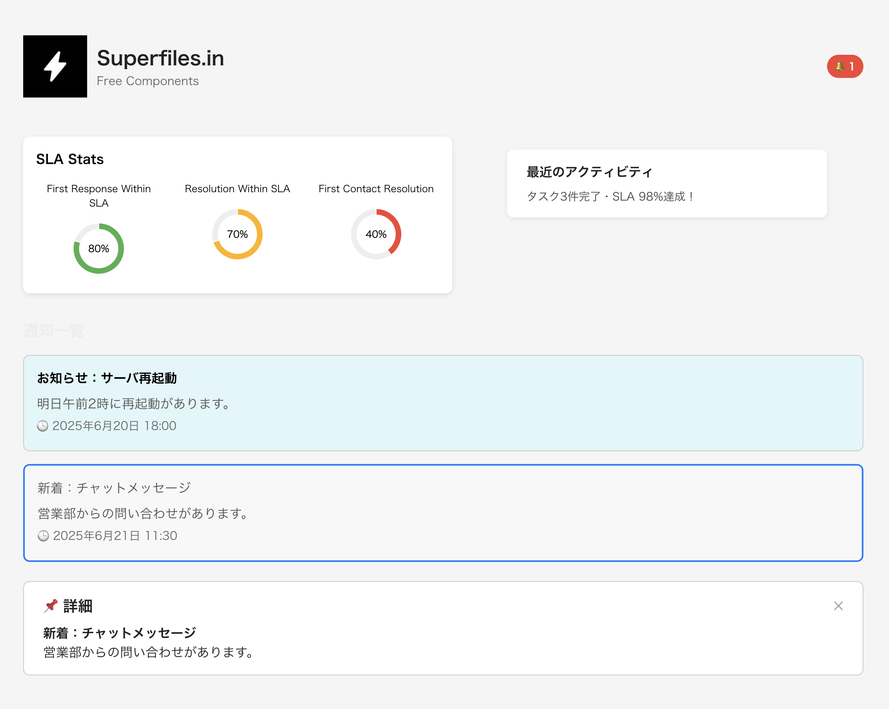

# Reactダッシュボードポートフォリオ

## 📝 概要
このアプリは、**React + Next.js** で構築したダッシュボードUIのポートフォリオです。  
通知一覧・詳細表示・グラフ表示など、**実務に近いUI構成**を意識して制作しました。  
ポートフォリオや社内ツールのたたき台として活用できます。

## 🚀 使用技術スタック
- Next.js / React / TypeScript
- CSS Modules
- Recharts（グラフ描画）
- Vercel（ホスティング）

## 🔧 主な機能
実務を想定した情報表示UIを実装しています。

- 通知一覧（未読・既読状態あり）
- 通知クリックで詳細表示＆ハイライト
- 統計グラフ（円グラフ・レスポンシブ対応）

## 🌐 デモ
こちらから実際に触れます👇  
🔗 https://react-dashboard-hazel-zeta.vercel.app


## 📁 ディレクトリ構成
```bash
src/
├── components/       // UIコンポーネント
├── pages/            // 各ページ（/contact, /works など）
├── styles/           // CSS Modules
└── utils/            // 補助関数
```

## 🔨 セットアップ
```bash
git clone https://github.com/sunrise-hackdays/react-dashboard.git
cd react-dashboard
npm install
npm run dev
```

## 🎯 制作背景と目的
ReactやNext.jsの実務経験をアピールするため、
通知・統計・詳細表示UIの再現に重点を置いたダッシュボードを制作しました。
案件参画時に「React経験あります！」と自信を持って言えるようになるのが目的です。

## 💡 工夫したポイント
- 状態管理・条件分岐・動的レンダリングを駆使した「Reactらしい構成」
- 通知の未読／既読切り替えや選択中のハイライト表示
- スマホ対応（レスポンシブ）でどのデバイスでも見やすく
- グラフ表示には Recharts を採用し、視認性アップ

## 今後の予定
- 通知一覧をAPI取得に対応（外部連携の練習）
- Tailwind CSS導入（デザインの再構成）
- 管理画面系ポートフォリオとして、ログイン／ユーザー管理なども追加予定
