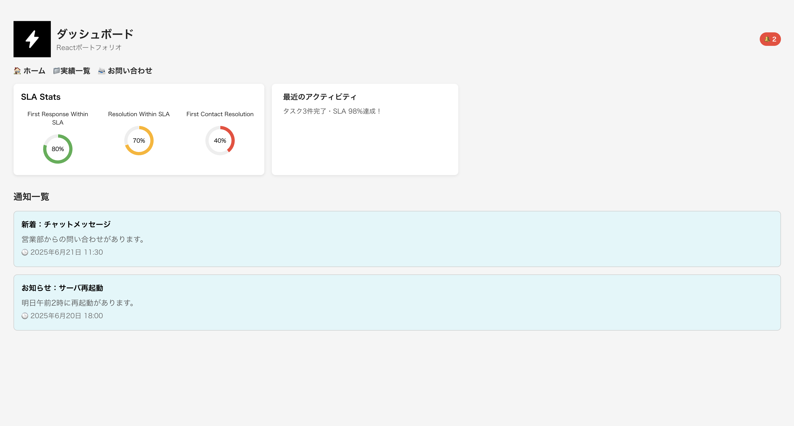

# Reactダッシュボードポートフォリオ

## 概要
このアプリは、React + Next.jsで構築したダッシュボードUIのサンプルです。  
通知一覧・詳細表示・グラフ表示など、実務に近い構成を意識して制作しました。  
ポートフォリオや業務UIのたたき台として活用できます。

## 使用技術
- Next.js
- React
- TypeScript
- CSS Modules
- Recharts
- Vercel（デプロイ）

## 機能
実務を想定した情報表示UI（通知・統計・詳細表示）を実装しています。

- 通知一覧の表示（未読・既読）
- 通知の詳細表示とハイライト
- ダッシュボード統計グラフ（円グラフ）
- レスポンシブ対応

## デモ
こちらから実際に触れます👇  
🌐 https://react-dashboard.vercel.app


## セットアップ方法
```bash
git clone https://github.com/sunrise-hackdays/react-dashboard.git  
cd react-dashboard  
npm install  
npm run dev

## 背景と目的
エンジニアとしてのスキルを整理・発信するため、ReactとNext.jsで実務に近いダッシュボードUIを制作。
案件参画時に「React経験あり」と自信を持って言えるようにすることが目的です。

## 工夫したポイント
- 状態管理・条件分岐・動的レンダリングなど、Reactらしさを意識した構成
- 通知の未読／既読切り替えやハイライト表示など、実務にありがちなUIの再現
- スマホでも見やすいように、レスポンシブ対応も実装済み
- グラフ表示には Recharts を採用して視覚的にもわかりやすく

## 今後の予定
- 通知一覧をAPIから取得する構成に変更して、外部連携の練習
- Tailwind CSS を導入して、デザインの再構成
- 管理画面系ポートフォリオとして、ログイン／ユーザー管理なども追加予定